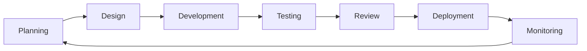

# 🔧 Development Process & Guidelines

> **Our development philosophy**: Build with quality, iterate with speed, and always keep the user experience at the center.

## 🏗️ Development Methodology

### Agile Development Approach
We follow an **Agile methodology** with elements of **Scrum** and **Kanban**:

- **Sprint Duration**: 2-week sprints
- **Planning**: Sprint planning every 2 weeks
- **Daily Standups**: Quick progress updates
- **Reviews**: Sprint reviews and retrospectives
- **Continuous Integration**: Automated testing and deployment

### Development Workflow



## 📋 Project Management

### Task Management
We use **GitHub Issues** and **Project Boards** for task management:

#### Issue Labels
- 🐛 `bug` - Something isn't working
- ✨ `enhancement` - New feature or request
- 📚 `documentation` - Improvements or additions to docs
- 🚀 `feature` - New feature implementation
- 🔧 `maintenance` - Code maintenance and refactoring
- 🎨 `ui/ux` - User interface and experience improvements
- ⚡ `performance` - Performance improvements
- 🔒 `security` - Security-related issues

#### Priority Levels
- 🔥 **Critical** - Must be fixed immediately
- 🚨 **High** - Should be addressed in current sprint
- 📊 **Medium** - Important but not urgent
- 📝 **Low** - Nice to have features

### Sprint Planning Process

#### 1. **Backlog Grooming** (Weekly)
- Review and prioritize backlog items
- Estimate story points using Planning Poker
- Break down large features into smaller tasks
- Define acceptance criteria

#### 2. **Sprint Planning** (Bi-weekly)
- Select items from backlog for upcoming sprint
- Assign tasks to team members
- Set sprint goals and objectives
- Create sprint board

#### 3. **Daily Standups** (Daily)
- What did you accomplish yesterday?
- What will you work on today?
- Are there any blockers or impediments?

## 💻 Development Standards

### Code Quality Standards

#### Frontend (React)
```javascript
// ✅ Good: Functional components with hooks
const ChatWindow = ({ chat, user, messages }) => {
  const [message, setMessage] = useState('');
  
  useEffect(() => {
    // Effect logic here
  }, [dependencies]);
  
  return (
    <div className="chat-window">
      {/* Component JSX */}
    </div>
  );
};

// ❌ Avoid: Class components (unless necessary)
class OldComponent extends React.Component {
  // Avoid this pattern
}
```

#### Backend (PHP)
```php
<?php
// ✅ Good: Clean, documented code
class ChatService {
    /**
     * Send a message to a chat
     * @param int $chatId
     * @param int $userId  
     * @param string $message
     * @return array Response data
     */
    public function sendMessage(int $chatId, int $userId, string $message): array {
        // Implementation
    }
}
?>
```

### Coding Conventions

#### File Naming
- **React Components**: PascalCase (`ChatWindow.jsx`)
- **PHP Files**: snake_case (`chat_api.php`)
- **CSS Classes**: kebab-case (`chat-window`)
- **JavaScript Variables**: camelCase (`userName`)

#### Code Structure
```
Component Structure:
├── Imports
├── Component Definition
├── State Management
├── Event Handlers
├── useEffect Hooks
├── Render Logic
└── Styles (styled-jsx)
```

### Git Workflow

#### Branch Naming Convention
- `main` - Production-ready code
- `develop` - Integration branch for features
- `feature/feature-name` - New features
- `bugfix/bug-description` - Bug fixes
- `hotfix/critical-fix` - Critical production fixes

#### Commit Message Format
```
<type>(<scope>): <subject>

<body>

<footer>
```

**Examples:**
```bash
feat(chat): add message reactions functionality
fix(auth): resolve login validation issue
docs(readme): update installation instructions
style(ui): improve button hover animations
```

#### Pull Request Process
1. **Create Feature Branch**
   ```bash
   git checkout -b feature/new-chat-feature
   ```

2. **Make Changes and Commit**
   ```bash
   git add .
   git commit -m "feat(chat): implement new feature"
   ```

3. **Push and Create PR**
   ```bash
   git push origin feature/new-chat-feature
   ```

4. **Code Review Process**
   - At least 1 reviewer required
   - All tests must pass
   - Code coverage requirements met
   - Documentation updated if needed

## 🧪 Testing Strategy

### Testing Pyramid

```
        /\
       /  \
      / UI \
     /______\
    /        \
   /Integration\
  /__________  \
 /              \
/   Unit Tests   \
/________________\
```

### Frontend Testing
```javascript
// Unit Tests - Jest & React Testing Library
import { render, screen } from '@testing-library/react';
import ChatWindow from './ChatWindow';

test('renders chat window with messages', () => {
  render(<ChatWindow chat={mockChat} messages={mockMessages} />);
  expect(screen.getByText('Test message')).toBeInTheDocument();
});

// Integration Tests
test('sends message when form is submitted', async () => {
  // Test integration between components
});
```

### Backend Testing
```php
// PHPUnit Tests
class ChatApiTest extends PHPUnit\Framework\TestCase {
    public function testSendMessage() {
        $response = $this->chatApi->sendMessage(1, 1, 'Test message');
        $this->assertEquals('success', $response['status']);
    }
}
```

### Testing Checklist
- [ ] Unit tests for all new functions
- [ ] Integration tests for API endpoints
- [ ] UI tests for critical user flows
- [ ] Cross-browser compatibility testing
- [ ] Mobile responsiveness testing
- [ ] Performance testing
- [ ] Security testing

## 🚀 Deployment Process

### Environment Strategy
- **Development** - Local development environment
- **Staging** - Pre-production testing environment  
- **Production** - Live application environment

### Deployment Pipeline

```yaml
# GitHub Actions CI/CD Pipeline
name: Deploy Talksy
on:
  push:
    branches: [main]

jobs:
  test:
    runs-on: ubuntu-latest
    steps:
      - name: Run Tests
        run: npm test
      
  build:
    runs-on: ubuntu-latest
    steps:
      - name: Build Application
        run: npm run build
        
  deploy:
    runs-on: ubuntu-latest
    steps:
      - name: Deploy to Production
        run: ./deploy.sh
```

### Deployment Checklist
- [ ] All tests passing
- [ ] Code review completed
- [ ] Documentation updated
- [ ] Database migrations tested
- [ ] Backup created
- [ ] Performance monitoring active
- [ ] Rollback plan prepared

## 📊 Quality Assurance

### Code Review Guidelines

#### What to Look For
- **Functionality** - Does the code work as intended?
- **Performance** - Is the code efficient?
- **Security** - Are there any security vulnerabilities?
- **Maintainability** - Is the code easy to understand and modify?
- **Testing** - Are there adequate tests?

#### Review Checklist
- [ ] Code follows established conventions
- [ ] No hard-coded values or credentials
- [ ] Error handling implemented
- [ ] Performance considerations addressed
- [ ] Documentation updated
- [ ] Tests added/updated
- [ ] No console.log statements in production code

### Performance Monitoring

#### Key Metrics
- **Page Load Time** - < 3 seconds
- **API Response Time** - < 200ms
- **Database Query Time** - < 100ms
- **Memory Usage** - Monitored and optimized
- **Error Rates** - < 1% error rate

#### Monitoring Tools
- **Frontend**: Google Lighthouse, Web Vitals
- **Backend**: APM tools, database monitoring
- **Infrastructure**: Server monitoring, uptime tracking

## 🔒 Security Practices

### Security Guidelines
- **Input Validation** - Sanitize all user inputs
- **Authentication** - Use secure session management
- **Authorization** - Implement proper access controls
- **Data Protection** - Encrypt sensitive data
- **API Security** - Use HTTPS and proper headers
- **Regular Updates** - Keep dependencies updated

### Security Checklist
- [ ] SQL injection prevention
- [ ] XSS protection implemented
- [ ] CSRF tokens used
- [ ] Rate limiting configured
- [ ] Security headers set
- [ ] Dependencies scanned for vulnerabilities

## 📚 Documentation Standards

### Code Documentation
```javascript
/**
 * Sends a message to a specific chat
 * @param {Object} messageData - The message data
 * @param {string} messageData.text - Message content
 * @param {number} messageData.chatId - Target chat ID
 * @param {string} messageData.type - Message type (text|image|file)
 * @returns {Promise<Object>} Response object with status and message
 */
async function sendMessage(messageData) {
  // Implementation
}
```

### API Documentation
All API endpoints should be documented with:
- Purpose and description
- Request parameters
- Response format
- Error codes
- Example requests/responses

### User Documentation
- Installation guides
- Feature explanations
- Troubleshooting guides
- FAQ sections

## 🤝 Team Collaboration

### Communication Channels
- **Daily Communication**: Slack/Discord
- **Code Discussions**: GitHub Issues/PRs
- **Documentation**: Confluence/Notion
- **Meetings**: Zoom/Google Meet

### Meeting Structure
- **Daily Standups** (15 min) - Progress and blockers
- **Sprint Planning** (2 hours) - Sprint goals and tasks
- **Sprint Review** (1 hook) - Demo and feedback
- **Retrospective** (1 hour) - Process improvements

### Knowledge Sharing
- **Code Reviews** - Share knowledge through reviews
- **Documentation** - Document decisions and processes
- **Tech Talks** - Regular team learning sessions
- **Pair Programming** - Collaborative development

## 🎯 Continuous Improvement

### Metrics We Track
- **Development Velocity** - Story points per sprint
- **Code Quality** - Test coverage, code complexity
- **Bug Rate** - Defects per feature
- **Team Satisfaction** - Regular team surveys

### Improvement Process
1. **Collect Data** - Gather metrics and feedback
2. **Analyze** - Identify improvement opportunities
3. **Plan** - Create improvement initiatives
4. **Implement** - Execute improvements
5. **Measure** - Track results and iterate

---

## 📞 Support & Resources

### Getting Help
- **Technical Issues**: Create GitHub issue
- **Process Questions**: Ask team lead
- **Emergency**: Contact on-call developer

### Useful Resources
- [React Documentation](https://reactjs.org/docs)
- [PHP Best Practices](https://phptherightway.com/)
- [MySQL Documentation](https://dev.mysql.com/doc/)
- [Git Guidelines](https://git-scm.com/docs)

---

**📝 This document is regularly updated to reflect our evolving development practices.**

**Last Updated**: September 17, 2025
**Next Review**: October 1, 2025
