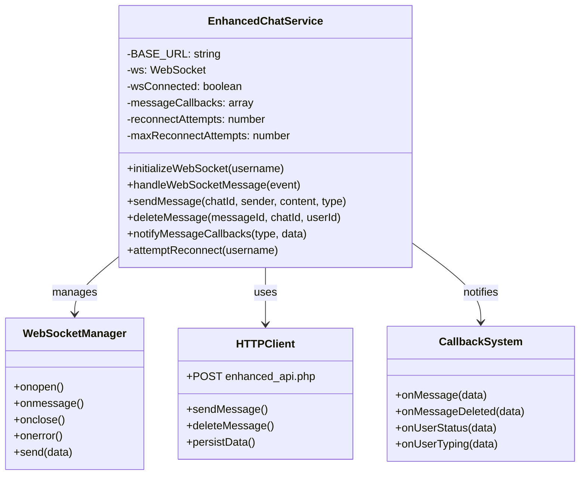

# Enhanced Chat Service Documentation

## 🏗️ Architecture Overview

The Enhanced Chat Service implements a **dual-channel communication pattern** combining WebSocket real-time messaging with HTTP API persistence for optimal user experience.

### 🎯 Core Design Principles

1. **Zero Latency Messaging**: WebSocket delivers messages instantly
2. **Reliable Persistence**: HTTP API ensures data durability  
3. **Optimistic UI Updates**: Immediate feedback with temporary IDs
4. **Automatic Recovery**: Reconnection handling with exponential backoff
5. **Event-Driven Architecture**: Callback system for reactive UI updates

## 📊 Class Structure



## 🔄 Message Flow Process

### 1. **Initialization Flow**
```javascript
// Step 1: Initialize WebSocket connection
service.initializeWebSocket('username')
  ↓
// Step 2: Establish WebSocket connection
new WebSocket('ws://localhost:8080')
  ↓
// Step 3: Authenticate user
ws.send({type: 'auth', username: 'username'})
  ↓
// Step 4: Connection ready
wsConnected = true
```

### 2. **Send Message Flow**
```javascript
// User sends message
sendMessage(chatId, sender, content, type)
  ↓
// Generate temporary ID
tempId = 'temp_' + Date.now()
  ↓
// PARALLEL EXECUTION:
// Branch A: Instant WebSocket ⚡
ws.send({
  type: 'message',
  chatId, sender, content,
  tempId, instant: true
})
// Branch B: HTTP Persistence 💾
fetch('/enhanced_api.php', {
  action: 'send_message',
  chatId, sender, content
})
  ↓
// Return immediately for UI
return {id: tempId, instant: true}
```

### 3. **Receive Message Flow**
```javascript
// WebSocket receives message
ws.onmessage(event)
  ↓
// Parse and handle message
handleWebSocketMessage(event)
  ↓
// Route by message type
switch(data.type) {
  case 'new_message': → onMessage callback
  case 'message_deleted': → onMessageDeleted callback
  case 'user_status': → onUserStatus callback
  case 'user_typing': → onUserTyping callback
}
  ↓
// Notify React components
notifyMessageCallbacks(type, data)
```

## 💡 Key Features Explained

### ⚡ **Zero Latency Strategy**
```javascript
// 1. Send via WebSocket immediately (no waiting)
if (this.ws && this.ws.readyState === WebSocket.OPEN) {
  this.ws.send(JSON.stringify({
    type: 'message',
    instant: true,
    tempId: 'temp_' + Date.now()
  }));
}

// 2. API persistence runs in background
fetch('/api').then(response => {
  // Handle success/failure without blocking UI
}).catch(error => {
  console.error('Persistence failed:', error);
});

// 3. Return immediately for instant UI feedback
return {
  id: 'temp_' + Date.now(),
  instant: true // Flag for UI to handle appropriately
};
```

### 🔄 **Auto-Reconnection Logic**
```javascript
ws.onclose = () => {
  this.wsConnected = false;
  
  // Exponential backoff reconnection
  const delay = Math.pow(2, this.reconnectAttempts) * 1000;
  
  setTimeout(() => {
    if (this.reconnectAttempts < this.maxReconnectAttempts) {
      this.attemptReconnect(username);
      this.reconnectAttempts++;
    }
  }, delay);
};
```

### 📡 **Callback Event System**
```javascript
// React components subscribe to events
chatService.addMessageCallback({
  onMessage: (data) => {
    setMessages(prev => [...prev, data]);
  },
  onMessageDeleted: (data) => {
    setMessages(prev => prev.filter(m => m.id !== data.messageId));
  },
  onUserTyping: (data) => {
    setTypingUsers(prev => ({...prev, [data.username]: data.isTyping}));
  }
});
```

## 🛠️ Implementation Patterns

### **1. Dual-Channel Communication**
- **WebSocket**: Real-time events, typing indicators, status updates
- **HTTP API**: Data persistence, file uploads, authentication

### **2. Optimistic UI Updates**
- Show messages immediately with temporary IDs
- Replace with real IDs when API confirms persistence
- Handle failures gracefully with retry mechanisms

### **3. Event-Driven Architecture**
- Service emits events via callback system
- React components subscribe to relevant events
- Loose coupling between service and UI components

### **4. Connection State Management**
- Track WebSocket connection status
- Queue messages when disconnected
- Automatic reconnection with exponential backoff

## 🎨 **How to Represent This Visually**

### **Option 1: Component Flow Diagram**
```
┌─────────────────┐    ┌──────────────────┐    ┌─────────────────┐
│   React UI      │◄──►│ EnhancedChat     │◄──►│   WebSocket     │
│   Components    │    │    Service       │    │   Connection    │
└─────────────────┘    └──────────────────┘    └─────────────────┘
                                │                        │
                                ▼                        ▼
                       ┌──────────────────┐    ┌─────────────────┐
                       │   HTTP API       │    │   Backend       │
                       │   Client         │    │   Server        │
                       └──────────────────┘    └─────────────────┘
```

### **Option 2: Message Flow Timeline**
```
User Action → Instant WebSocket → Background API → UI Update
     │              │                   │            │
     ▼              ▼                   ▼            ▼
  Send Msg      Real-time           Persistence   Confirmed
  (click)       Delivery            (database)    Message
```

### **Option 3: State Diagram**
```
[Disconnected] → initializeWebSocket() → [Connecting] → onopen() → [Connected]
                                              │                        │
                                              ▼                        ▼
                                         [Error] ←── onerror() ── [Reconnecting]
                                              │                        │
                                              └─── attemptReconnect() ─┘
```

## 🚀 **Benefits of This Architecture**

1. **🌟 User Experience**: Instant message delivery
2. **🔒 Data Integrity**: Reliable persistence layer  
3. **📱 Responsive UI**: Optimistic updates
4. **🔄 Resilience**: Auto-recovery from connection issues
5. **⚡ Performance**: Parallel processing of real-time and persistence
6. **🧩 Modularity**: Clean separation of concerns

This architecture ensures your Talksy chat feels instant while maintaining data reliability! 🎉
