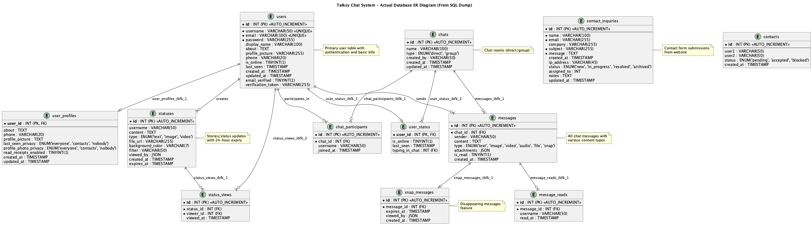

## 3.4 Talksy Database Schema

### 📊 Schema Overview

The Talksy database consists of **12 interconnected tables** designed for optimal performance in a real-time chat application. The schema balances normalization principles with practical flexibility for modern messaging features.

**Key Statistics:**
- **Tables**: 12 total
- **Engine**: InnoDB with ACID compliance
- **Character Set**: utf8mb4 (full Unicode support)
- **Design Philosophy**: Username-based references with JSON extensibility

### 🗂️ Table Categories

| Category | Tables | Purpose |
|----------|--------|---------|
| **👤 User Management** | `users`, `user_profiles`, `user_status` | Authentication, profiles, presence tracking |
| **💬 Chat System** | `chats`, `chat_participants`, `messages`, `message_reads` | Conversations, messaging, read receipts |
| **📱 Social Features** | `statuses`, `status_views`, `snap_messages` | Stories, ephemeral content, view tracking |
| **👥 Relationships** | `contacts`, `contact_inquiries` | User connections, support system |

### 🎯 Core Tables Summary

| Table | Records | Key Features | Performance Notes |
|-------|---------|--------------|-------------------|
| **users** | User accounts | Unique username/email, online status, verification | Indexed on username, email |
| **chats** | Conversations | Direct/group types, creation tracking | Auto-increment ID, timestamp tracking |
| **messages** | Chat messages | Multi-media support, attachments (JSON) | Indexed on chat_id for fast retrieval |
| **statuses** | Stories/updates | 24-hour TTL, view tracking (JSON) | Automatic expiration with expires_at |
| **message_reads** | Read receipts | Per-user read tracking | Composite index on message_id, username |

### 🔗 Visual Schema



*Complete visual representation showing all table relationships and constraints*

### ⚡ Performance Optimizations

- **Indexes**: Strategic indexing on frequently queried columns
- **JSON Storage**: Flexible metadata for attachments and viewers
- **Timestamps**: Automatic created_at/updated_at tracking
- **TTL Support**: Built-in expiration for temporary content

### 🛡️ Data Integrity Features

- **Primary Keys**: Auto-incrementing IDs on all core tables
- **Unique Constraints**: Username and email uniqueness enforcement
- **Foreign Key Ready**: Structured for FK constraints (currently using username references)
- **Data Types**: Appropriate field sizes and types for each purpose

### 📋 Complete Schema Definition

<details>
<summary><strong>🔍 Click to view complete CREATE TABLE statements</strong></summary>

```sql
-- ==========================================
-- TALKSY DATABASE SCHEMA (Production Ready)
-- ==========================================

-- 👤 USER MANAGEMENT TABLES

-- users: Core user accounts and authentication
CREATE TABLE `users` (
  `id` int(11) NOT NULL AUTO_INCREMENT,
  `username` varchar(50) NOT NULL,
  `email` varchar(100) NOT NULL,
  `password` varchar(255) NOT NULL,
  `display_name` varchar(100) DEFAULT NULL,
  `about` text DEFAULT 'Hey there! I am using Talksy.',
  `profile_picture` varchar(255) DEFAULT NULL,
  `phone` varchar(20) DEFAULT NULL,
  `is_online` tinyint(1) DEFAULT 0,
  `last_seen` timestamp NOT NULL DEFAULT current_timestamp(),
  `created_at` timestamp NOT NULL DEFAULT current_timestamp(),
  `updated_at` timestamp NOT NULL DEFAULT current_timestamp() ON UPDATE current_timestamp(),
  `email_verified` tinyint(1) DEFAULT 0,
  `verification_token` varchar(255) DEFAULT NULL,
  PRIMARY KEY (`id`),
  UNIQUE KEY `username` (`username`),
  UNIQUE KEY `email` (`email`)
) ENGINE=InnoDB DEFAULT CHARSET=utf8mb4;

-- user_profiles: Extended profile information
CREATE TABLE `user_profiles` (
  `user_id` int(11) NOT NULL,
  `about` text DEFAULT 'Hey there! I am using Talksy.',
  `phone` varchar(20) DEFAULT NULL,
  `profile_picture` text DEFAULT NULL,
  `last_seen_privacy` enum('everyone','contacts','nobody') DEFAULT 'everyone',
  `profile_photo_privacy` enum('everyone','contacts','nobody') DEFAULT 'everyone',
  `read_receipts_enabled` tinyint(1) DEFAULT 1,
  `created_at` timestamp NOT NULL DEFAULT current_timestamp(),
  `updated_at` timestamp NOT NULL DEFAULT current_timestamp() ON UPDATE current_timestamp(),
  PRIMARY KEY (`user_id`)
) ENGINE=InnoDB DEFAULT CHARSET=utf8mb4;

-- user_status: Real-time presence tracking
CREATE TABLE `user_status` (
  `user_id` int(11) NOT NULL,
  `is_online` tinyint(1) DEFAULT 0,
  `last_seen` timestamp NOT NULL DEFAULT current_timestamp() ON UPDATE current_timestamp(),
  `typing_in_chat` int(11) DEFAULT NULL,
  PRIMARY KEY (`user_id`)
) ENGINE=InnoDB DEFAULT CHARSET=utf8mb4;

-- 💬 CHAT SYSTEM TABLES

-- chats: Conversation containers (direct/group)
CREATE TABLE `chats` (
  `id` int(11) NOT NULL AUTO_INCREMENT,
  `name` varchar(100) DEFAULT NULL,
  `type` enum('direct','group') DEFAULT 'direct',
  `created_by` varchar(50) DEFAULT NULL,
  `created_at` timestamp NOT NULL DEFAULT current_timestamp(),
  `updated_at` timestamp NOT NULL DEFAULT current_timestamp() ON UPDATE current_timestamp(),
  PRIMARY KEY (`id`)
) ENGINE=InnoDB DEFAULT CHARSET=utf8mb4;

-- chat_participants: User participation in chats
CREATE TABLE `chat_participants` (
  `id` int(11) NOT NULL AUTO_INCREMENT,
  `chat_id` int(11) DEFAULT NULL,
  `username` varchar(50) DEFAULT NULL,
  `joined_at` timestamp NOT NULL DEFAULT current_timestamp(),
  PRIMARY KEY (`id`),
  KEY `chat_id` (`chat_id`)
) ENGINE=InnoDB DEFAULT CHARSET=utf8mb4;

-- messages: Chat messages with multimedia support
CREATE TABLE `messages` (
  `id` int(11) NOT NULL AUTO_INCREMENT,
  `chat_id` int(11) DEFAULT NULL,
  `sender` varchar(50) DEFAULT NULL,
  `content` text DEFAULT NULL,
  `type` enum('text','image','video','audio','file','snap') DEFAULT 'text',
  `attachments` longtext DEFAULT NULL,
  `is_read` tinyint(1) DEFAULT 0,
  `created_at` timestamp NOT NULL DEFAULT current_timestamp(),
  PRIMARY KEY (`id`),
  KEY `chat_id` (`chat_id`)
) ENGINE=InnoDB DEFAULT CHARSET=utf8mb4;

-- message_reads: Read receipt tracking
CREATE TABLE `message_reads` (
  `id` int(11) NOT NULL AUTO_INCREMENT,
  `message_id` int(11) DEFAULT NULL,
  `username` varchar(50) DEFAULT NULL,
  `read_at` timestamp NOT NULL DEFAULT current_timestamp(),
  PRIMARY KEY (`id`),
  KEY `message_id` (`message_id`)
) ENGINE=InnoDB DEFAULT CHARSET=utf8mb4;

-- 📱 SOCIAL FEATURES TABLES

-- statuses: Stories and status updates (24h TTL)
CREATE TABLE `statuses` (
  `id` int(11) NOT NULL AUTO_INCREMENT,
  `username` varchar(50) DEFAULT NULL,
  `content` text DEFAULT NULL,
  `type` enum('text','image','video') DEFAULT 'text',
  `file_url` varchar(255) DEFAULT NULL,
  `background_color` varchar(7) DEFAULT NULL,
  `filter` varchar(50) DEFAULT NULL,
  `viewed_by` longtext DEFAULT NULL,
  `created_at` timestamp NOT NULL DEFAULT current_timestamp(),
  `expires_at` timestamp NOT NULL DEFAULT (current_timestamp() + interval 24 hour),
  PRIMARY KEY (`id`)
) ENGINE=InnoDB DEFAULT CHARSET=utf8mb4;

-- status_views: Status view tracking
CREATE TABLE `status_views` (
  `id` int(11) NOT NULL AUTO_INCREMENT,
  `status_id` int(11) NOT NULL,
  `viewer_id` int(11) NOT NULL,
  `viewed_at` timestamp NOT NULL DEFAULT current_timestamp(),
  PRIMARY KEY (`id`),
  UNIQUE KEY `unique_view` (`status_id`,`viewer_id`),
  KEY `viewer_id` (`viewer_id`)
) ENGINE=InnoDB DEFAULT CHARSET=utf8mb4;

-- snap_messages: Ephemeral messages with expiration
CREATE TABLE `snap_messages` (
  `id` int(11) NOT NULL AUTO_INCREMENT,
  `message_id` int(11) NOT NULL,
  `expires_at` timestamp NOT NULL DEFAULT current_timestamp() ON UPDATE current_timestamp(),
  `viewed_by` longtext DEFAULT NULL,
  `created_at` timestamp NOT NULL DEFAULT current_timestamp(),
  PRIMARY KEY (`id`),
  KEY `message_id` (`message_id`),
  KEY `idx_expires` (`expires_at`)
) ENGINE=InnoDB DEFAULT CHARSET=utf8mb4;

-- 👥 RELATIONSHIP TABLES

-- contacts: User-to-user relationships
CREATE TABLE `contacts` (
  `id` int(11) NOT NULL AUTO_INCREMENT,
  `user1` varchar(50) DEFAULT NULL,
  `user2` varchar(50) DEFAULT NULL,
  `status` enum('pending','accepted','blocked') DEFAULT 'accepted',
  `created_at` timestamp NOT NULL DEFAULT current_timestamp(),
  PRIMARY KEY (`id`)
) ENGINE=InnoDB DEFAULT CHARSET=utf8mb4;

-- contact_inquiries: Support/contact form submissions
CREATE TABLE `contact_inquiries` (
  `id` int(11) NOT NULL AUTO_INCREMENT,
  `name` varchar(100) NOT NULL,
  `email` varchar(255) NOT NULL,
  `company` varchar(255) DEFAULT NULL,
  `subject` varchar(255) NOT NULL DEFAULT 'General Inquiry',
  `message` text NOT NULL,
  `created_at` timestamp NOT NULL DEFAULT current_timestamp(),
  `ip_address` varchar(45) DEFAULT NULL,
  `status` enum('new','in_progress','resolved','archived') DEFAULT 'new',
  `assigned_to` int(11) DEFAULT NULL,
  `notes` text DEFAULT NULL,
  `updated_at` timestamp NOT NULL DEFAULT current_timestamp() ON UPDATE current_timestamp(),
  PRIMARY KEY (`id`),
  KEY `idx_email` (`email`),
  KEY `idx_created_at` (`created_at`),
  KEY `idx_status` (`status`)
) ENGINE=InnoDB DEFAULT CHARSET=utf8mb4;
```

</details>

### 🔧 Implementation Notes

1. **Deployment**: Import using `mysql -u root -p talksy < talksy.sql`
2. **Indexes**: Additional composite indexes recommended for high-traffic queries
3. **Migration Path**: Consider integer FKs for scalability in future versions
4. **Monitoring**: Track table sizes and query performance in production

### 📚 Related Documentation

- **ER Diagram Sources**: 
  - PlantUML: [`talksy_actual_er_diagram.puml`](../database/talksy_actual_er_diagram.puml)
  - Mermaid: [`talksy_actual_er_diagram.md`](../database/talksy_actual_er_diagram.md)
- **API Integration**: See Chapter 4 for database interaction patterns
- **WebSocket Events**: Real-time features utilize `user_status` and presence tracking
