# Talksy REST API Documentation

```mermaid
sequenceDiagram
    participant U as 👤 User
    participant F as 🌐 Frontend<br/>(React)
    participant API as 🔧 Enhanced API<br/>(PHP)
    participant DB as 🗄️ MySQL Database
    participant FS as 📁 File System<br/>(uploads/)

    Note over U, FS: Authentication & User Management

    U->>F: Register/Login 🔐
    F->>API: POST /enhanced_api.php<br/>{"action": "register", "username": "john", "email": "john@example.com"}
    API->>DB: INSERT INTO users<br/>(username, email, password_hash)
    DB->>API: ✅ User created with ID
    API->>F: {"success": true, "user": {...}}
    F->>U: Registration successful ✅

    F->>API: POST /enhanced_api.php<br/>{"action": "login", "username": "john", "password": "***"}
    API->>DB: SELECT * FROM users WHERE username = ?
    DB->>API: User data with hashed password
    API->>API: 🔐 Verify password_verify()
    API->>F: {"success": true, "user": {...}}

    Note over U, FS: Profile Management

    U->>F: View Profile 👤
    F->>API: POST /enhanced_api.php<br/>{"action": "get_user_profile", "username": "john"}
    API->>DB: SELECT users u JOIN user_profiles up<br/>ON u.id = up.user_id
    DB->>API: Profile data (display_name, about, phone, etc.)
    API->>F: {"success": true, "profile": {...}}

    U->>F: Update Profile ✏️
    F->>API: POST /enhanced_api.php<br/>{"action": "update_user_profile", "display_name": "John Doe"}
    API->>DB: UPDATE user_profiles SET display_name = ?
    DB->>API: ✅ Profile updated
    API->>F: {"success": true}

    U->>F: Upload Profile Picture 📸
    F->>API: POST /enhanced_api.php + FormData<br/>{"action": "upload_profile_picture", file: blob}
    API->>FS: 💾 SAVE to uploads/profiles/
    FS->>API: File path returned
    API->>DB: UPDATE user_profiles SET profile_picture = ?
    API->>F: {"success": true, "profile_picture": "uploads/profiles/john_123.jpg"}

    Note over U, FS: User Search & Contacts

    U->>F: Search Users 🔍
    F->>API: POST /enhanced_api.php<br/>{"action": "search_users", "query": "jane"}
    API->>DB: SELECT * FROM users<br/>WHERE username LIKE '%jane%'
    DB->>API: Matching users list
    API->>F: {"success": true, "users": [...]}

    F->>API: POST /enhanced_api.php<br/>{"action": "get_user_contacts", "username": "john"}
    API->>DB: SELECT contacts c JOIN users u<br/>ON c.contact_username = u.username
    DB->>API: Contact list with profile data
    API->>F: {"success": true, "contacts": [...]}

    Note over U, FS: Chat Management

    U->>F: Open Chat App 💬
    F->>API: POST /enhanced_api.php<br/>{"action": "setup_database"}
    API->>DB: CREATE TABLES IF NOT EXISTS<br/>(users, chats, messages, etc.)
    API->>F: {"success": true, "message": "Database ready"}

    F->>API: POST /enhanced_api.php<br/>{"action": "get_chats", "username": "john"}
    API->>DB: 🔍 Complex JOIN chats c, chat_participants cp,<br/>users u, messages m (last message, unread count)
    DB->>API: Chat list with metadata
    API->>F: {"success": true, "chats": [...]}

    U->>F: Start New Chat ➕
    F->>API: POST /enhanced_api.php<br/>{"action": "create_chat", "currentUser": "john", "targetUser": "jane"}
    API->>DB: 🔄 BEGIN TRANSACTION
    API->>DB: INSERT INTO chats (type, created_by)
    API->>DB: INSERT INTO chat_participants × 2
    API->>DB: ✅ COMMIT
    DB->>API: New chat created with ID
    API->>F: {"success": true, "chat": {...}}

    Note over U, FS: Message Operations

    U->>F: Load Messages 📜
    F->>API: POST /enhanced_api.php<br/>{"action": "get_messages", "chatId": 1, "limit": 50}
    API->>DB: SELECT messages m JOIN users u<br/>WHERE chat_id = ? ORDER BY created_at DESC
    DB->>API: Messages with sender info
    API->>F: {"success": true, "messages": [...]}

    U->>F: Send Message 📤
    F->>API: POST /enhanced_api.php<br/>{"action": "send_message", "chatId": 1, "content": "Hello!"}
    API->>DB: INSERT INTO messages<br/>(chat_id, sender, content, type, created_at)
    DB->>API: Message saved with ID
    API->>API: 🔔 Notify WebSocket (optional)
    API->>F: {"success": true, "message": {...}}

    U->>F: Upload File 📎
    F->>API: POST /enhanced_api.php + FormData<br/>{"action": "upload_file", file: blob}
    API->>FS: 💾 SAVE to uploads/chat_files/
    FS->>API: File path returned
    API->>DB: INSERT INTO messages<br/>(type="file", attachments=JSON)
    API->>F: {"success": true, "fileUrl": "uploads/chat_files/file_123.jpg"}

    U->>F: Delete Message 🗑️
    F->>API: POST /enhanced_api.php<br/>{"action": "delete_message", "messageId": 123}
    API->>DB: SELECT sender FROM messages WHERE id = ?
    API->>API: 🔐 Authorize (sender == username)
    API->>DB: DELETE FROM messages WHERE id = ?
    API->>F: {"success": true}

    Note over U, FS: Read Receipts & Status

    U->>F: Mark as Read ✅
    F->>API: POST /enhanced_api.php<br/>{"action": "mark_messages_read", "messageIds": [1,2,3]}
    API->>DB: INSERT INTO message_reads<br/>ON DUPLICATE KEY UPDATE
    DB->>API: Read receipts recorded
    API->>F: {"success": true}

    Note over U, FS: Status/Story Management

    U->>F: Upload Status 📱
    F->>API: POST /enhanced_api.php + FormData<br/>{"action": "upload_status", "content": "Great day!"}
    API->>FS: 💾 SAVE to uploads/status/
    API->>DB: INSERT INTO statuses<br/>(expires_at = NOW() + 24h)
    API->>F: {"success": true, "status": {...}}

    F->>API: POST /enhanced_api.php<br/>{"action": "get_statuses", "username": "john"}
    API->>DB: SELECT statuses WHERE expires_at > NOW()
    DB->>API: Active statuses list
    API->>F: {"success": true, "statuses": [...]}

    F->>API: POST /enhanced_api.php<br/>{"action": "get_contacts_statuses", "username": "john"}
    API->>DB: 🔍 Complex JOIN statuses s, contacts c<br/>WHERE contact relationship
    DB->>API: Contacts' active statuses
    API->>F: {"success": true, "statuses": [...]}

    U->>F: View Status 👁️
    F->>API: POST /enhanced_api.php<br/>{"action": "view_status", "statusId": 123}
    API->>DB: UPDATE statuses SET<br/>viewed_by = JSON_ARRAY_APPEND(viewed_by, '$', 'john')
    API->>F: {"success": true}

    Note over U, FS: Online Status & Error Handling

    F->>API: POST /enhanced_api.php<br/>{"action": "update_online_status", "isOnline": true}
    API->>DB: UPDATE users SET is_online = ?, last_seen = NOW()
    API->>F: {"success": true}

    F->>API: POST /enhanced_api.php<br/>{"action": "invalid_action"}
    API->>API: ⚠️ Try-Catch Exception handling
    API->>F: {"success": false, "message": "Invalid action"}
```



## 🔧 API Endpoints Reference

### Authentication Endpoints

| Action | Method | Endpoint | Purpose | Request Body |
|--------|--------|----------|---------|--------------|
| `register` | POST | `/enhanced_api.php` | Create new user account | `{"action": "register", "username": "john", "email": "john@example.com", "password": "***"}` |
| `login` | POST | `/enhanced_api.php` | Authenticate existing user | `{"action": "login", "username": "john", "password": "***"}` |

### Profile Management

| Action | Method | Endpoint | Purpose | Request Body |
|--------|--------|----------|---------|--------------|
| `get_user_profile` | POST | `/enhanced_api.php` | Get user profile data | `{"action": "get_user_profile", "username": "john"}` |
| `update_user_profile` | POST | `/enhanced_api.php` | Update profile information | `{"action": "update_user_profile", "username": "john", "display_name": "John Doe", "about": "Hey there!"}` |
| `upload_profile_picture` | POST | `/enhanced_api.php` | Upload profile picture | FormData with file + `{"action": "upload_profile_picture"}` |
| `search_users` | POST | `/enhanced_api.php` | Search for users | `{"action": "search_users", "query": "jane"}` |
| `get_user_contacts` | POST | `/enhanced_api.php` | Get user's contact list | `{"action": "get_user_contacts", "username": "john"}` |

### Chat Management

| Action | Method | Endpoint | Purpose | Request Body |
|--------|--------|----------|---------|--------------|
| `setup_database` | POST | `/enhanced_api.php` | Initialize database tables | `{"action": "setup_database"}` |
| `get_chats` | POST | `/enhanced_api.php` | Get user's chat list | `{"action": "get_chats", "username": "john"}` |
| `create_chat` | POST | `/enhanced_api.php` | Create new chat/conversation | `{"action": "create_chat", "currentUser": "john", "targetUser": "jane"}` |
| `get_messages` | POST | `/enhanced_api.php` | Load chat messages | `{"action": "get_messages", "chatId": 1, "username": "john", "limit": 50, "offset": 0}` |

### Message Operations

| Action | Method | Endpoint | Purpose | Request Body |
|--------|--------|----------|---------|--------------|
| `send_message` | POST | `/enhanced_api.php` | Send text/media message | `{"action": "send_message", "chatId": 1, "sender": "john", "content": "Hello!", "type": "text"}` |
| `delete_message` | POST | `/enhanced_api.php` | Delete a message | `{"action": "delete_message", "messageId": 123, "username": "john"}` |
| `mark_messages_read` | POST | `/enhanced_api.php` | Mark messages as read | `{"action": "mark_messages_read", "chatId": 1, "username": "john", "messageIds": [1,2,3]}` |
| `upload_file` | POST | `/enhanced_api.php` | Upload file/attachment | FormData with file + `{"action": "upload_file", "chatId": 1, "sender": "john"}` |

### Status/Story Management

| Action | Method | Endpoint | Purpose | Request Body |
|--------|--------|----------|---------|--------------|
| `upload_status` | POST | `/enhanced_api.php` | Upload status/story | FormData with file + `{"action": "upload_status", "content": "Great day!", "type": "image"}` |
| `get_statuses` | POST | `/enhanced_api.php` | Get user's statuses | `{"action": "get_statuses", "username": "john"}` |
| `get_contacts_statuses` | POST | `/enhanced_api.php` | Get contacts' statuses | `{"action": "get_contacts_statuses", "username": "john"}` |
| `view_status` | POST | `/enhanced_api.php` | Mark status as viewed | `{"action": "view_status", "username": "john", "statusId": 123}` |
| `delete_status` | POST | `/enhanced_api.php` | Delete a status | `{"action": "delete_status", "username": "john", "statusId": 123}` |
| `get_status_viewers` | POST | `/enhanced_api.php` | Get who viewed status | `{"action": "get_status_viewers", "statusId": 123}` |

### Online Status & Presence

| Action | Method | Endpoint | Purpose | Request Body |
|--------|--------|----------|---------|--------------|
| `update_online_status` | POST | `/enhanced_api.php` | Update user online status | `{"action": "update_online_status", "username": "john", "isOnline": true}` |

## 📝 Response Format

All API endpoints return JSON responses in this format:

### Success Response
```json
{
  "success": true,
  "data": { /* endpoint-specific data */ },
  "message": "Operation completed successfully"
}
```

### Error Response
```json
{
  "success": false,
  "message": "Error description",
  "error_code": "SPECIFIC_ERROR_CODE"
}
```

## 🔐 Security Features

### ✅ CORS Configuration
- **Cross-Origin** requests allowed from `localhost:3000`
- **Methods** allowed: GET, POST, PUT, DELETE, OPTIONS
- **Headers** allowed: Content-Type, Authorization, X-Requested-With
- **Credentials** enabled for authenticated requests

### 🛡️ Input Validation
- **JSON validation** with `json_decode()` error checking
- **Required fields** validation for each action
- **SQL injection** prevention using prepared statements
- **File upload** validation (size, type, extension)

### 🔒 Authentication & Authorization
- **Password hashing** using `password_hash()` and `password_verify()`
- **Message ownership** verification before deletion/editing
- **User permission** checks for private operations

### 📁 File Upload Security
- **File type** validation (images, documents)
- **File size** limits (max 10MB)
- **Safe filename** generation to prevent path traversal
- **Organized storage** in structured upload directories

## 🚀 Performance Features

### ⚡ Database Optimization
- **Prepared statements** for all queries
- **Transaction support** for multi-step operations
- **Efficient JOINs** for complex data retrieval
- **Indexed columns** for fast lookups

### 💾 Caching Strategy
- **No-cache headers** for real-time data freshness
- **File system** caching for uploads
- **Database query** optimization with LIMIT/OFFSET pagination

### 🔄 Real-time Integration
- **WebSocket notifications** for instant message delivery
- **Parallel processing** (HTTP API + WebSocket)
- **Optimistic updates** on frontend with API confirmation
