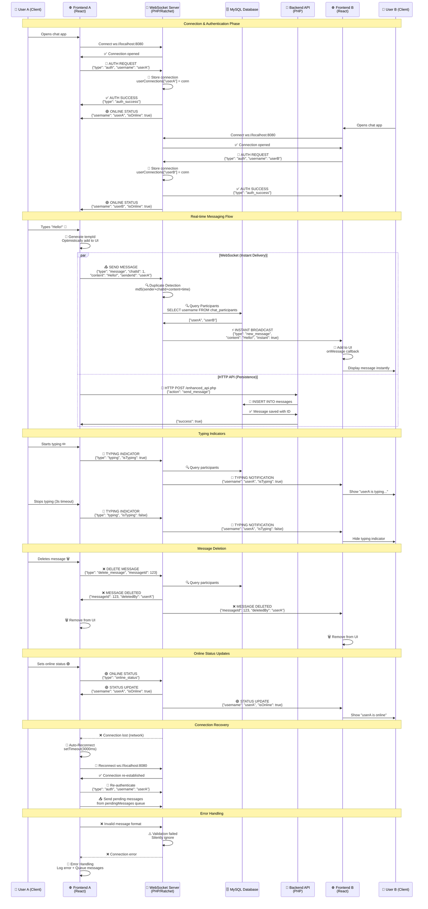

# Talksy WebSocket Communication Flow

## WebSocket Message Types

### Client-to-Server Messages

| Message Type | Purpose | Payload Example |
|--------------|---------|-----------------|
| `auth` | Authenticate user connection | `{"type": "auth", "username": "userA"}` |
| `message` | Send chat message | `{"type": "message", "chatId": 1, "content": "Hello!", "senderId": "userA", "messageType": "text", "tempId": "temp_123"}` |
| `delete_message` | Delete a message | `{"type": "delete_message", "messageId": 123, "chatId": 1}` |
| `typing` | Send typing indicator | `{"type": "typing", "chatId": 1, "isTyping": true}` |
| `online_status` | Update online status | `{"type": "online_status"}` |

### Server-to-Client Messages

| Message Type | Purpose | Payload Example |
|--------------|---------|-----------------|
| `auth_success` | Confirm authentication | `{"type": "auth_success", "username": "userA"}` |
| `new_message` | Broadcast new message | `{"type": "new_message", "chatId": 1, "senderId": "userA", "content": "Hello!", "timestamp": "2025-10-28T10:30:00Z", "instant": true}` |
| `message_deleted` | Notify message deletion | `{"type": "message_deleted", "messageId": 123, "chatId": 1, "deletedBy": "userA", "timestamp": "2025-10-28T10:30:00Z"}` |
| `typing` | Notify typing status | `{"type": "typing", "chatId": 1, "username": "userA", "isTyping": true}` |
| `online_status` | Notify user online/offline | `{"type": "online_status", "username": "userA", "isOnline": true}` |

## Key Features

### 🚀 Zero-Latency Messaging
- **Instant WebSocket delivery** to all chat participants
- **Optimistic UI updates** for immediate feedback
- **Parallel HTTP persistence** doesn't block real-time delivery

### 🔍 Duplicate Prevention
- **Message signature** using MD5 hash of sender + chatId + content + time window
- **3-second timeout** window for duplicate detection
- **Recent messages cache** with automatic cleanup

### 🔄 Connection Management
- **Auto-reconnection** after 3 seconds on disconnect
- **Pending message queue** for offline messages
- **Connection state tracking** (wsConnected boolean)

### 📝 Real-time Indicators
- **Typing indicators** with automatic timeout
- **Online/offline status** broadcast to all users
- **Message read receipts** (via HTTP API)

### 🛡️ Error Handling
- **Invalid message validation** on server
- **Silent error recovery** on client
- **Graceful degradation** when WebSocket unavailable
